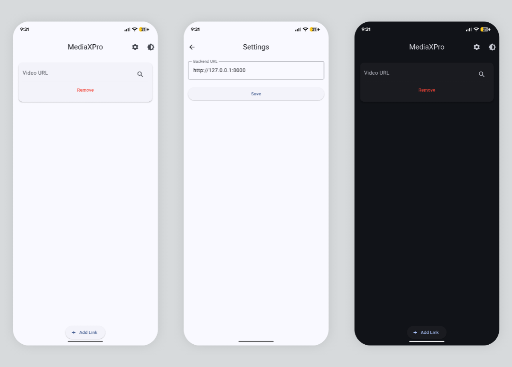

# 📱 MediaXPro – Flutter Video Downloader

A high-performance, minimalist Flutter client for downloading online videos (Facebook, YouTube, TikTok, etc.) through a private `yt-dlp` backend.

MediaXPro uses **Stream Downloading** to ensure low memory footprints on mobile devices and utilizes the **Android MediaStore API** to save videos directly to the public gallery without requiring intrusive storage permissions.

---

## 📸 Screenshot



---

## ✨ Features

* **🔗 Bulk Processing:** Add multiple video link cards for concurrent management.
* **🎥 Deep Analysis:** Fetches real-time metadata, resolutions, and format options from the backend.
* **⬇️ Stream-to-Disk:** Downloads data in chunks to handle large files with minimal RAM usage.
* **📂 Scoped Storage:** Auto-saves to `Movies/mediaxpro`—instantly visible in the Gallery.
* **🌓 Material 3 UI:** Seamlessly switch between Light and Dark themes.
* **🔐 Dynamic Configuration:** Easily update backend URL settings for local or cloud environments.
* **🚫 Permission Light:** No legacy storage permissions required on Android 11+.

---

## 🧱 Tech Stack

* **Flutter:** Material 3 Design.
* **Dio:** Advanced networking for streaming and timeouts.
* **MediaStore Plus:** Seamless integration with Android's MediaStore API.
* **Shared Preferences:** Persistent storage for backend configuration.
* **Path Provider:** Handling temporary file buffers during download.

---

## 📂 Project Structure

```text
lib/
├── services/
│   ├── api_service.dart     # Unified networking & download logic
│   └── backend_config.dart  # Settings & URL persistence
├── screens/
│   ├── home_page.dart       # Main UI & download cards
│   └── settings_page.dart   # Backend URL configuration
└── main.dart                # App entry point & initialization

```

---

## 🛠 Setup & Installation

### Prerequisites

1. **Backend:** Ensure your Python/yt-dlp backend is running. [MediaXPro API Backend](https://github.com/chhengz/mediaxpro-api.git)
2. **Flutter:** v3.10.0 or higher.

### Quick Start

```bash
#Clone the repository
git clone https://github.com/chhengz/mediaxpro.git

#Get dependencies
flutter pub get

#Launch on Android
flutter run
```

## 🔐 Configuration (Settings Page)

To connect the app to your server:

1. Tap the **Settings (⚙️)** icon in the AppBar.
2. Enter your server URL (e.g., `http://192.168.1.5:8000`).
3. Click **Save**. The app will now route all requests to your custom backend.

---

## 📥 Download Behavior

* **Path:** `/storage/emulated/0/Movies/mediaxpro/`
* **Behavior:** Data is streamed through a temporary directory and moved to the Public Gallery upon completion.
* **Cleanup:** Temporary fragments are automatically deleted to save device space.

---

## ⚠️ Known Behaviors

* **Merging Lag:** Progress may appear "stuck" at 99% or show indeterminate status while the backend merges high-quality Audio & Video streams.
* **Format Compatibility:** Use `.mp4` formats for the best compatibility with the Android system player.

---

## 👨‍💻 Developer

Develop by **@chheng_hilo**
